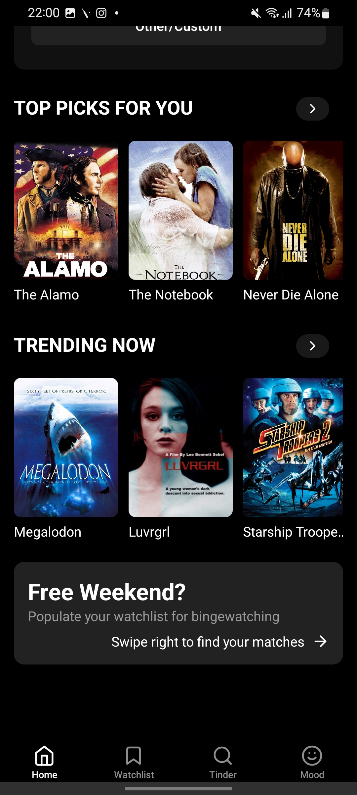
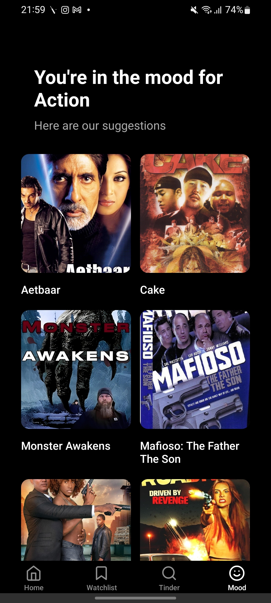
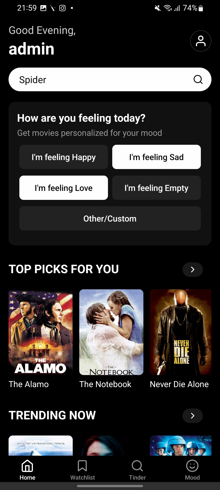
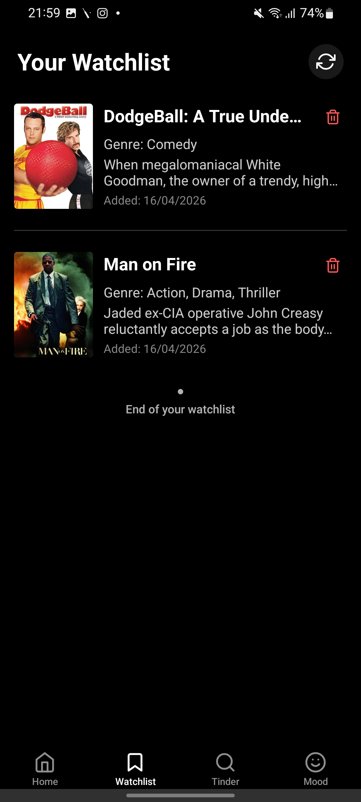

  

  <h1>MovieVerse</h1>
  
<strong>Discover what to watch next with AI mood intelligence, swipe-native discovery, and personalized ranking.</strong>

  

    
    
    
    
  

  <h2>Demo</h2>

  

    
  

  

    <a href="https://movieverse.jefin.xyz"><strong>View Live Demo →</strong></a>
  

  

    Website: <a href="https://movieverse.jefin.xyz">movieverse.jefin.xyz</a> •
    Backend API: <a href="https://movieversebackend.jefin.xyz">movieversebackend.jefin.xyz</a> •
    Mobile APK: <a href="https://github.com/jefin10/MovieVerse/releases/download/v1.0.0/movieverse.apk">Download</a>
  

  

    
    
    
    
  

## About
MovieVerse cuts movie selection time by combining mood detection, collaborative filtering, and swipe-first interaction in one product. Users get a public web catalog for frictionless browsing and a mobile app for full personalization, watchlist control, and rating-driven recommendations. This architecture improves discovery quality while keeping the experience fast on real networks and devices.

## Tech Stack
| Technology | Why It Was Chosen |
| --- | --- |
| React Native | Delivers one codebase for native-feeling iOS and Android UX. |
| Expo | Speeds mobile iteration, OTA updates, and device testing with minimal setup. |
| TypeScript | Enforces type safety across mobile, web, and API contracts. |
| Next.js (App Router) | Provides performant server rendering and SEO-friendly web browsing pages. |
| React | Enables component-driven UI composition and predictable state updates. |
| TailwindCSS | Accelerates consistent UI styling with utility-first classes. |
| Django 5.2 | Offers mature security defaults and strong batteries-included backend tooling. |
| Django REST Framework | Standardizes REST endpoints with serializers, auth, and pagination primitives. |
| PostgreSQL | Handles relational movie, rating, and watchlist queries with strong indexing support. |
| scikit-learn | Supplies production-proven ML algorithms and vectorization utilities. |
| TF-IDF Vectorization | Converts mood text into weighted numerical features for robust classification. |
| Multinomial Naive Bayes | Delivers fast and reliable mood-to-genre prediction for short text input. |
| Cosine Similarity | Powers content and rating similarity scoring for recommendation ranking. |
| Docker | Creates reproducible local and production runtime environments. |
| Nginx | Serves as reverse proxy and TLS termination layer in deployment. |
| Let's Encrypt SSL | Automates trusted HTTPS certificate issuance and renewal. |
| AWS EC2 | Provides flexible, cost-effective compute for containerized deployment. |
| Django Session Authentication | Protects user sessions for mobile and web API workflows. |
| Token-Based Auth | Supports stateless API access patterns where token flow is preferred. |
| AsyncStorage | Persists sessions and dual-layer cache for resilient mobile behavior. |
| Browser Cache | Reduces repeat payloads and improves perceived speed on web pages. |
| TMDB API | Enriches the catalog with high-quality movie metadata and poster assets. |

## Key Features
- 🎯 Accelerate discovery with hybrid recommendations that blend ratings, content similarity, and mood classification.
- 😊 Translate mood text into genre-aware picks using TF-IDF plus Multinomial Naive Bayes.
- 👉 Swipe through movies Tinder-style and add to watchlist instantly with haptic and visual feedback.
- 🔐 Secure accounts with registration, login, logout, CSRF protection, and OTP-based password recovery.
- ⭐ Learn user taste continuously through 1-5 star ratings that improve recommendation quality over time.
- ⚡ Optimize latency using dual-layer caching, request deduplication, and stale-while-revalidate behavior.
- 🌐 Serve both audiences with a public web catalog and a fully personalized mobile application.
- 🐳 Deploy reliably through Dockerized services, PostgreSQL persistence, and HTTPS-ready infrastructure.

## Getting Started
### Prerequisites
~~~text
Node.js 20+
npm 10+
Python 3.11+
Docker + Docker Compose
Expo Go (for mobile testing)
~~~

### Installation
1. Clone the repository.
~~~bash
git clone https://github.com/jefin10/MovieVerse.git
cd MovieVerse
~~~

2. Configure backend environment variables.
~~~bash
cd MovieVerseBackend
cp .env.example .env
cd ..
~~~

3. Start backend + PostgreSQL with Docker.
~~~bash
cd MovieVerseBackend
docker compose up --build -d
cd ..
~~~

4. Run the web app.
~~~bash
cd movieverse-website
npm install
npm run dev
~~~

5. Run the mobile app.
~~~bash
cd MovieVerseApp
npm install
npx expo start
~~~

## Usage
### Example 1: Get AI mood-based recommendations
~~~bash
curl -X POST "https://movieversebackend.jefin.xyz/ai/recommend/" \
  -H "Content-Type: application/json" \
  -d '{"mood":"I want something emotional but uplifting"}'
~~~

### Example 2: Use MovieVerse dual-layer cache with request deduplication
~~~typescript
import axios from "axios";
import { fetchWithCache } from "../app/services/cache";

type Movie = {
  id: number;
  title: string;
  poster_url: string;
};

const api = axios.create({
  baseURL: "https://movieversebackend.jefin.xyz",
  withCredentials: true,
});

export async function getTrendingMovies(forceRefresh = false): Promise<Movie[]> {
  return fetchWithCache<Movie[]>({
    key: "trending:v1",
    ttlMs: 5 * 60 * 1000,
    forceRefresh,
    staleIfError: true,
    fetcher: async () => {
      const res = await api.get("/api/Trending/");
      return res.data;
    },
  });
}
~~~

## Architecture
~~~text
MovieVerse/
├─ MovieVerseApp/        # Expo + React Native client (auth, swipe, mood, watchlist)
├─ movieverse-website/   # Next.js web catalog for public browsing
├─ MovieVerseBackend/    # Django API, PostgreSQL integration, Docker deployment files
│  └─ backend/           # Django apps: api, users, ai, and project settings
├─ MovieverseAI/         # Model training scripts, datasets, and feature generation
└─ media/                # README assets (logo and screenshots)
~~~

## Roadmap
- ✅ Ship mobile authentication flow with OTP-based password recovery.
- ✅ Launch mood-to-genre recommendation endpoint in production.
- ✅ Build custom PanResponder swiper with duplicate prevention.
- ✅ Release public web catalog with pagination and search.
- 🔲 Add social watchlists and collaborative list sharing.
- 🔲 Introduce observability dashboards for recommendation quality and API latency.

## Contributing
1. Fork the repository and clone your fork locally.
2. Create a feature branch, commit focused changes, and push.
3. Open a pull request with context, screenshots, and test notes.

## License + Contact
License: MIT

GitHub: https://github.com/jefin10

LinkedIn: https://www.linkedin.com/in/jefin10/

Built to demonstrate production-grade full-stack engineering, practical ML integration, and polished product delivery.
